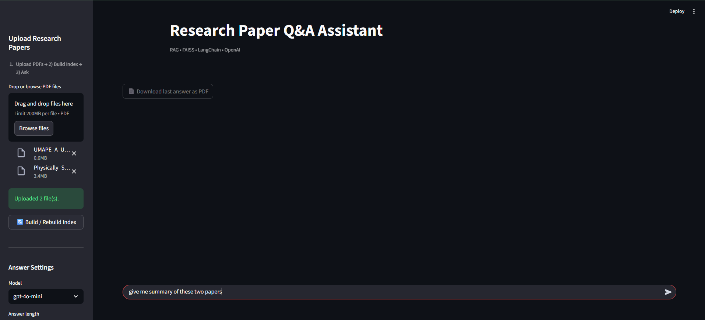

# 🧠 Research Paper Q&A Assistant  
### _(LangChain + RAG + OpenAI GPT-4o-mini + Streamlit)_

A **Retrieval-Augmented Generation (RAG)** powered web app that lets you **upload research papers (PDFs)**, build a local **vector index (FAISS)**, and ask **intelligent academic questions** in a ChatGPT-like interface.

The assistant uses **LangChain**, **OpenAI embeddings**, and **GPT-4o-mini** to generate grounded answers with proper citations — all wrapped in a sleek, **Streamlit chat UI** that feels like ChatGPT itself.

---

## 🚀 Features

✅ Upload one or more research papers (PDF)  
✅ Automatic text extraction, chunking, and vector embedding  
✅ Fast semantic search using **FAISS**  
✅ Ask natural-language questions about your papers  
✅ Structured, academic-tone answers with inline citations  
✅ Choose answer length (short / medium / long)  
✅ Switch between **GPT-4o-mini** (cheap) and **GPT-4o** (detailed)  
✅ Download answers as **PDF reports**  
✅ Persistent chat history within session  
✅ Smart index caching (no need to rebuild every time)

---

## 🖥️ Application Screenshot

<p align="center">
  
</p>

> *The Streamlit ChatGPT-like interface — upload research papers, ask questions, view grounded answers with citations, and download responses as PDFs.*

---

## 🏗️ Tech Stack

| Layer | Technology |
|-------|-------------|
| **Frontend / UI** | Streamlit (chat interface) |
| **LLM** | OpenAI `gpt-4o-mini` (default) / `gpt-4o` |
| **Framework** | LangChain (community + openai + core + text-splitters) |
| **Vector DB** | FAISS (CPU) |
| **Embeddings** | `text-embedding-3-small` |
| **PDF Parsing** | `PyPDFLoader` (`langchain_community.document_loaders`) |
| **Export** | ReportLab (generate downloadable answer PDFs) |
| **Environment** | `.env` + `python-dotenv` |
| **Runtime** | Python 3.10 + |

---

## 📁 Project Structure

```plaintext
research-paper-qa-assistant/
│
├── 📄 .env                                    # Contains OPENAI_API_KEY
├── 📄 .gitignore                              # Git ignore rules
├── 📄 requirements.txt                        # Python dependencies
├── 📄 README.md                               # Project documentation
│
├── 📂 data/                                   # Data storage directory
│   ├── 📂 pdfs/                               # Uploaded PDFs
│   └── 📂 index/faiss/                        # Saved FAISS index (index.faiss, index.pkl)
│
├── 📂 assets/                                 # Optional logos or images
│
└── 📂 src/                                    # Source code directory
    ├── 📄 ingest.py                           # Load PDFs → split → embed → build FAISS
    ├── 📄 rag_chain.py                        # Retrieval + LLM answering logic
    ├── 📄 ui_app.py                           # Streamlit chat interface (ChatGPT-style)
    │
    └── 📂 utils/                              # Utility modules
        ├── 📄 __init__.py
        └── 📄 pdf_exporter.py                 # Export answers to PDF
```

---

## 🧩 System Architecture

<p align="center">
  
</p>

> *End-to-end architecture of the Research Paper Q&A Assistant — showing the full RAG pipeline: from PDF upload, text extraction, embedding, and FAISS retrieval to OpenAI-powered answer generation and Streamlit visualization.*

---

## ⚙️ Installation

### 1️⃣ Clone the repo
```bash
git clone https://github.com/Nikhil2418/Research-Paper-Q-A-Assistant.git
cd research-paper-qa-assistant
```

### 2️⃣ Create a virtual environment
```bash
python -m venv venv

# On Windows
venv\Scripts\activate

# On macOS/Linux
source venv/bin/activate
```

### 3️⃣ Install dependencies
```bash
pip install -r requirements.txt
```

### 4️⃣ Set up environment variables
Create a `.env` file in the project root:
```env
OPENAI_API_KEY=your_openai_api_key_here
```

### 5️⃣ Create necessary directories
```bash
mkdir -p data/pdfs data/index/faiss assets
```

### 6️⃣ Run the application
```bash
streamlit run src/ui_app.py
```

The app will open in your browser at `http://localhost:8501`

---

## 🔄 How It Works (Workflow)

### Step 1: Upload PDFs

* Upload one or more research papers through the sidebar.
* Files are saved to `data/pdfs/`.

### Step 2: Build Index

* Click "Build / Rebuild Index" once.
* This triggers:
  * PDF loading via `PyPDFLoader`
  * Text splitting (RecursiveCharacterTextSplitter)
  * Embedding generation (OpenAI)
  * FAISS vector index creation
* The index is saved under `data/index/faiss/`.

### Step 3: Ask Questions

* Use the chat input at the bottom like ChatGPT.
* Adjust:
  * Answer length: short / medium / long
  * Model: `gpt-4o-mini` or `gpt-4o`
  * Retriever Top-K: controls number of chunks retrieved
* The assistant retrieves top-K chunks, builds a context prompt, and generates an academic-style answer.

### Step 4: View Citations & Export

* Every answer includes a "📚 Sources" section listing all referenced PDFs.
* Click "📄 Download last answer as PDF" to export a formatted report.

---

## 🧩 Prompt Design

### System Role:
"You are an intelligent research assistant that analyzes academic papers. Use only the provided context, structure your answers clearly, and cite sources like [PaperName.pdf]."

### Answer Styles

| Mode | Max Tokens | Description |
|------|------------|-------------|
| short | 250 | Concise summary (~150–220 words) |
| medium | 450 | Balanced answer (~250–400 words) |
| long | 800 | Detailed synthesis (~450–700 words) |

---

## 💡 Example Queries

**Comparative Analysis:**
```
"Compare the methodology used in paper A and paper B."
"What are the differences in accuracy between the ML models discussed?"
```

**Summarization:**
```
"Summarize all related work sections from uploaded papers."
"What are the main findings across all papers?"
```

**Technical Details:**
```
"What IoT security challenges are mentioned?"
"Explain the PUF-based authentication approach."
"List all machine learning algorithms discussed."
```

---

## 🧱 Future Enhancements

* Hybrid retrieval (BM25 + Vector)
* Reranker for better chunk ordering
* "Show retrieved passages" toggle
* Token-streaming (type-as-you-think) answers
* Cost meter and per-query caching
* Dockerfile & Streamlit Cloud demo
* Section filter (Abstract / Intro / Methods / Results)
* Evaluation harness (QA + keywords → precision@k)

---

## 🐛 Troubleshooting

**Issue: "OpenAI API Key not found"**
- Ensure `.env` file contains `OPENAI_API_KEY=your_key`

**Issue: "Index not built"**
- Click "🔄 Build Index" after uploading PDFs

**Issue: "No relevant documents found"**
- Verify PDFs uploaded correctly
- Rebuild index
- Try rephrasing your question

---

## 📄 License

This project is licensed under the MIT License.

---

## 👨‍💻 Author

**Nikhil Kumar**  
M.Tech, Computer Science & Engineering  
Indian Institute of Technology (IIT) Jodhpur

📍 Research interests: IoT Security · PUF · Machine Learning · AI Agents  
🔗 [LinkedIn](https://linkedin.com/in/yourprofile) • [GitHub](https://github.com/Nikhil2418)

---

## 🙏 Acknowledgments

- **OpenAI** for GPT-4o-mini API
- **LangChain** for the RAG framework
- **Facebook AI** for FAISS
- **Streamlit** for the web framework

---

**Built with ❤️ for the research community**


